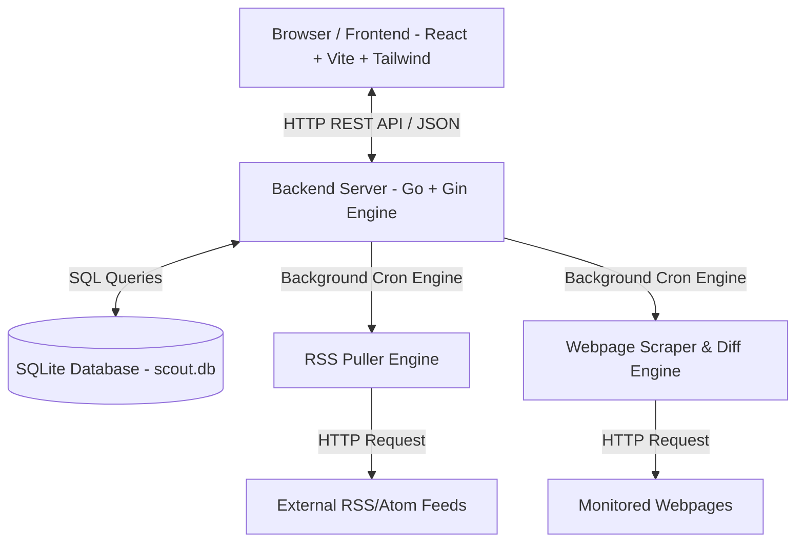

# 🛰️ SCOUT — App Architecture & Developer Guide

Welcome to the official developer guide for **SCOUT** (00 / SCOUT). 

This guide is designed for **everyone** — whether you are a non-coder, a designer, a junior developer, or an experienced engineer. It breaks down the entire system architecture in plain English, explains how every folder and file works, provides step-by-step instructions for running the local environment, and shows you exactly how to add or update features.

---

## 📚 Table of Contents

1. [High-Level Architecture (Plain English)](#1-high-level-architecture-plain-english)
2. [Folder & Directory Map](#2-folder--directory-map)
   - [Root Folder](#root-folder)
   - [Backend Architecture (`backend/`)](#backend-architecture-backend)
   - [Frontend Architecture (`frontend/`)](#frontend-architecture-frontend)
3. [Local Development Setup (How to Run Everything)](#3-local-development-setup-how-to-run-everything)
   - [Prerequisites](#prerequisites)
   - [Option A: Running Backend & Frontend Together (Recommended for Local Dev)](#option-a-running-backend--frontend-together-recommended-for-local-dev)
   - [Option B: Single-Binary Production Build](#option-b-single-binary-production-build)
4. [How Data Flows Through the App](#4-how-data-flows-through-the-app)
   - [RSS Article Fetch Workflow](#rss-article-fetch-workflow)
   - [Webpage Monitor Scrape & Diff Workflow](#webpage-monitor-scrape--diff-workflow)
5. [How to Modify and Add Features (Step-by-Step Walkthroughs)](#5-how-to-modify-and-add-features-step-by-step-walkthroughs)
   - [How to Add a New Backend REST Endpoint](#how-to-add-a-new-backend-rest-endpoint)
   - [How to Add a New Frontend Screen or Feature](#how-to-add-a-new-frontend-screen-or-feature)
   - [How to Adjust UI Styling & Theme Colors](#how-to-adjust-ui-styling--theme-colors)
6. [Key Rules & Visual Restyling Constraints](#6-key-rules--visual-restyling-constraints)
7. [Troubleshooting & FAQs](#7-troubleshooting--faqs)

---

## 1. High-Level Architecture (Plain English)

SCOUT is built using a **2-Tier Decoupled Architecture** with a single-binary production bundler:



### The 3 Core Components

1. **Frontend (The Visual App - React + Vite + Tailwind CSS)**
   - What the user sees in the browser.
   - Built with **React 19**, **Vite** (super-fast bundler), **TanStack Query** (data fetching & caching), and **Tailwind CSS** (styling).
   - Talks to the backend via HTTP REST API requests.

2. **Backend (The Brain - Go + Gin Web Framework)**
   - Runs in the background on your machine or server.
   - Built with **Go** (Golang) for maximum speed and tiny memory footprint.
   - Uses the **Gin** HTTP router to process requests (`/api/v1/feeds`, `/api/v1/monitored-pages`, etc.).

3. **Database & Engines (The Memory & Automation - SQLite + Goquery)**
   - **SQLite**: A single-file database (`scout.db` or `fusion.db`) that stores all feeds, articles, webpage monitors, groups, and snapshots.
   - **RSS Puller**: Background loop that periodically fetches RSS XML from websites and saves new articles.
   - **Webpage Scraper & Diff Engine**: Background engine using `goquery` (HTML parser) and `sergi/go-diff` to detect changes on monitored web pages and highlight additions in **light green**.

---

## 2. Folder & Directory Map

Here is the repository directory map and what every single file does:

```
Project Scout/
├── AGENTS.md                  # Project rules & visual restyling constraints
├── README.md                  # Main overview & quickstart README
├── ARCHITECTURE_AND_DEV_GUIDE.md # (THIS GUIDE) Complete architectural handbook
├── Dockerfile                 # Docker container builder recipe
├── docker-compose.yml         # One-command container launcher
├── scripts.sh                 # Helper script for building, testing, and bundling
│
├── backend/                   # 🐹 Go Backend Core
│   ├── cmd/fusion/main.go     # MAIN ENTRYPOINT: Starts database, background engines, and web server
│   └── internal/              # Internal packages
│       ├── model/             # Database structs & schemas (Feed, Article, MonitoredPage)
│       ├── store/             # SQLite queries & migrations (CREATE TABLE, SELECT, INSERT)
│       ├── handler/           # REST API routes (Gin controllers for feeds, items, monitors)
│       ├── pull/              # Background RSS article puller engine
│       ├── monitor/           # Background Webpage scraper, HTML cleaner & diff calculator
│       ├── auth/              # Password hashing & JWT session authentication
│       ├── config/            # Environment configuration loader (.env)
│       └── web/dist/          # Embedded production frontend files (compiled index.html & assets)
│
└── frontend/                  # ⚛️ React + TypeScript Frontend Core
    ├── index.html             # HTML shell containing page <title>Scout</title>
    ├── package.json           # Frontend dependencies & npm script commands
    ├── vite.config.ts         # Vite build tool configuration & proxy settings
    ├── public/                # Static icons, manifest.json (PWA details), favicons
    └── src/                   # React source code
        ├── main.tsx           # React app launcher
        ├── index.css          # Global Tailwind CSS utility styles & theme variables
        ├── typeset.css        # Typography styling for article reader
        ├── routes/            # Pages & URL routes (TanStack Router)
        │   ├── __root.tsx     # Application outer wrapper
        │   ├── index.lazy.tsx # Main RSS Feed Reader dashboard (3-pane layout)
        │   ├── monitors.lazy.tsx # Webpage Monitors dashboard (3-pane layout)
        │   └── feeds.lazy.tsx # Feed management & OPML import/export page
        ├── components/        # Reusable UI components
        │   ├── layout/        # Sidebar, topbar, app shell wrapper
        │   ├── feed/          # Feed item buttons, feed group collapsibles, feed list
        │   ├── article/       # Article list items, article view pane, reader toolbar
        │   └── monitor/       # Monitor diff view reader, add/edit dialogs
        ├── queries/           # React Query hooks for API communication (useFeeds, useMonitoredPages)
        ├── store/             # Local state management (Zustand & preferences)
        ├── lib/               # Utility functions (API client, date formatter, OPML parser)
        └── hooks/             # Custom React hooks (useUrlState, useKeybindings)
```

---

## 3. Local Development Setup (How to Run Everything)

### Prerequisites

Make sure you have the following installed on your computer:
1. **Go (Golang)**: Version `1.22` or higher (Download from [golang.org](https://go.dev/dl/)).
2. **Node.js**: Version `20` or higher (Download from [nodejs.org](https://nodejs.org/)).
3. **npm** or **pnpm**: Node package manager.

---

### Option A: Running Backend & Frontend Together (Recommended for Local Dev)

Running frontend and backend simultaneously allows you to make live edits with instant hot-reload:

#### Step 1: Start the Go Backend Server
Open Terminal Terminal #1:
```bash
cd "Project Scout"
FUSION_PASSWORD="admin" go run ./backend/cmd/fusion
```
*The Go backend will start on **`http://localhost:8080`** and create/update the SQLite database `scout.db`.*

#### Step 2: Start the Vite Frontend Dev Server
Open Terminal Terminal #2:
```bash
cd "Project Scout/frontend"
npm install
npm run dev
```
*Vite will start the dev server on **`http://localhost:5173`** (or `5174`). Open that URL in your browser, enter password `admin`, and you are ready to code!*

---

### Option B: Single-Binary Production Build

If you want to compile the frontend and backend into a single executable binary:

```bash
cd "Project Scout"
# 1. Build frontend & copy static files into backend/internal/web/dist
./scripts.sh build_frontend

# 2. Build single Go binary executable
cd backend
go build -o ../scout ./cmd/fusion

# 3. Run production binary
FUSION_PASSWORD="admin" ../scout
```
*Open `http://localhost:8080` in your browser.*

---

## 4. How Data Flows Through the App

### RSS Article Fetch Workflow
```
1. Background engine (pull/engine.go) wakes up every X minutes.
2. Fetches RSS XML from feeds stored in database table 'feeds'.
3. Parses XML items and inserts new rows into table 'items'.
4. User clicks feed in left sidebar -> frontend calls GET /api/v1/items?feed_id=12.
5. TanStack Query hook (queries/items.ts) receives JSON response and updates React UI.
```

### Webpage Monitor Scrape & Diff Workflow
```
1. User adds webpage URL (e.g., https://example.com) & optional CSS selector (e.g. .article-body).
2. Backend (monitor/scraper.go) uses goquery to download HTML and extract raw text.
3. If text changed from previous snapshot:
   - sergi/go-diff calculates line & word additions/deletions.
   - Wraps additions in <ins class="diff-ins bg-emerald-100 text-emerald-950 font-bold px-1 rounded">.
   - Wraps deletions in <del class="diff-del bg-rose-100 text-rose-950 line-through px-1 rounded">.
   - Inserts snapshot row into table 'monitored_page_snapshots'.
4. Frontend (components/monitor/monitor-diff-view.tsx) presents 3-way toggle:
   - [NEW CHANGES ONLY]: Displays newly added light-green cards.
   - [FULL DIFF]: Displays complete document diff.
   - [RAW TEXT]: Displays un-diffed current text.
```

---

## 5. How to Modify and Add Features (Step-by-Step Walkthroughs)

### How to Add a New Backend REST Endpoint

Suppose you want to add a new REST API endpoint `GET /api/v1/monitored-pages/stats`:

1. **Add Data Struct in `backend/internal/model/monitor.go`**:
   ```go
   type MonitorStats struct {
       TotalPages int `json:"total_pages"`
       TotalUnread int `json:"total_unread"`
   }
   ```

2. **Add Store Query Method in `backend/internal/store/monitor.go`**:
   ```go
   func (s *Store) GetMonitorStats() (*model.MonitorStats, error) {
       var stats model.MonitorStats
       err := s.db.QueryRow("SELECT COUNT(*), SUM(CASE WHEN unread = 1 THEN 1 ELSE 0 END) FROM monitored_pages").Scan(&stats.TotalPages, &stats.TotalUnread)
       return &stats, err
   }
   ```

3. **Add Handler Method in `backend/internal/handler/monitor.go`**:
   ```go
   func (h *Handler) GetMonitorStats(c *gin.Context) {
       stats, err := h.store.GetMonitorStats()
       if err != nil {
           c.JSON(http.StatusInternalServerError, gin.H{"error": err.Error()})
           return
       }
       c.JSON(http.StatusOK, stats)
   }
   ```

4. **Register Endpoint in `backend/internal/handler/handler.go`**:
   ```go
   v1.GET("/monitored-pages/stats", h.GetMonitorStats)
   ```

---

### How to Add a New Frontend Screen or Feature

Suppose you want to add a new UI feature or page:

1. **Add API Function in `frontend/src/lib/api/index.ts`**:
   ```ts
   export const monitoredPageAPI = {
     // ...
     getStats: () => request<MonitorStats>("/api/v1/monitored-pages/stats"),
   };
   ```

2. **Add TanStack Query Hook in `frontend/src/queries/monitors.ts`**:
   ```ts
   export function useMonitorStats() {
     return useQuery({
       queryKey: ["monitored-pages", "stats"],
       queryFn: () => monitoredPageAPI.getStats().then((res) => res.data),
     });
   }
   ```

3. **Use Hook in React Component**:
   ```tsx
   import { useMonitorStats } from "@/queries/monitors";

   export function StatsWidget() {
     const { data: stats } = useMonitorStats();
     return <div>Total Monitors: {stats?.total_pages}</div>;
   }
   ```

---

### How to Adjust UI Styling & Theme Colors

The app uses Tailwind CSS with custom editorial styling (`#FAF9F6` warm paper background, `#111111` dark text, `#B83A26` accent red, `#065F46` emerald green).

- **Global Utility Classes**: Edit `frontend/src/index.css`.
- **Component Specific Styles**: Use inline Tailwind utility classes (e.g. `bg-emerald-50 text-emerald-950 border-emerald-500 font-mono text-xs`).

---

## 6. Key Rules & Visual Restyling Constraints

When editing or updating the layout, **always follow these user-defined guidelines in `AGENTS.md`**:

1. **Preserve Document Flow Mechanics**:
   - Do NOT apply `display: grid` or `display: flex` to high-level content wrappers (`#stream`, `#global`) if they contain legacy inline elements or dynamic dynamic badges. Doing so breaks layout calculation and causes control overlaps.
2. **Template & Style Synchronization**:
   - If converting a view to a grid or card layout, update both the structural HTML wrapper and CSS together.
3. **No Superficial Symptom Patches**:
   - Never suppress errors by swallowing exceptions or returning dummy data. Fix the root cause in the backend handler or database query.

---

## 7. Troubleshooting & FAQs

#### Q: I made a change to a Go backend file, but the browser doesn't update!
> **Reason**: Go code is compiled. When you modify any `.go` file, stop the backend terminal (`Ctrl + C`) and restart it:
> `FUSION_PASSWORD="admin" go run ./backend/cmd/fusion`

#### Q: Frontend throws "API Error: 404 Not Found" or "Unknown Error"
> **Reason**: The backend server is not running or the router endpoint hasn't been registered. Check that `go run ./backend/cmd/fusion` is running in Terminal #1.

#### Q: How do I reset the SQLite database?
> Delete `scout.db` (or `fusion.db`) in the backend root directory. Restarting the backend will automatically re-run database migrations and re-create a clean database schema.

---

*Documentation maintained for **SCOUT (00 / SCOUT)**.*
