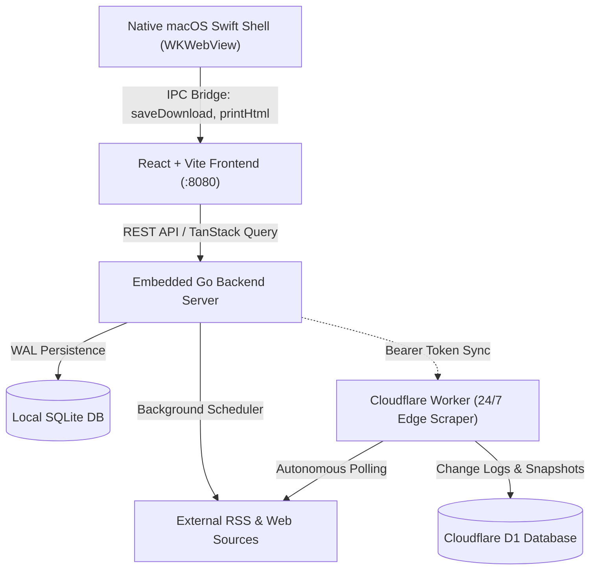

<div align="center">
  <h1>🔭 SCOUT</h1>
  <p><strong>Privacy-First Desktop Intelligence Dashboard, RSS Reader & Web Change Monitor</strong></p>
  <p>
    <a href="#key-features">Key Features</a> •
    <a href="#quickstart--installation">Installation</a> •
    <a href="#-247-monitoring-cloudflare-vs-local-fallback">24/7 Monitoring Guide</a> •
    <a href="#architecture">Architecture</a> •
    <a href="#contributing">Contributing</a> •
    <a href="#license">License</a>
  </p>
</div>

---

## What is Scout?

**Scout** is a modern, standalone macOS desktop application and self-hosted intelligence platform designed for researchers, analysts, and information workers who need high-velocity reading without noise, algorithmic feeds, or surveillance.

Unlike commercial feed readers that monetize user attention, push paid upsells, and track reading history, Scout runs **100% locally** with private SQLite storage and zero telemetry.

In addition to full-fidelity RSS/Atom feeds, Scout introduces an **Automated Webpage Differential Engine** that tracks arbitrary websites without RSS feeds, highlighting added and removed content side-by-side.

---

## ⚡ Key Features

- **🛡️ 100% Local-First & Private**: All articles, bookmarks, and read states are saved in your local SQLite database on your device. Zero telemetry, zero external tracking.
- **🔍 Webpage Change Monitoring**: Track non-RSS websites, blogs, or regulatory portals. Scout captures visual snapshots and displays side-by-side diffs highlighting new updates.
- **🛠️ Heuristic Feed Builder**: Paste any URL without an RSS feed. Scout scans repeating DOM layouts and auto-suggests CSS selectors to build a structured RSS feed instantly.
- **⌨️ High-Velocity Keyboard Triage**: Full keyboard navigation (`J`/`K` navigation, `O`/`Enter` open drawer, `M` toggle read, `B` bookmark, `X` toggle selection).
- **📦 Bulk Curation**: Multi-select articles with `Shift + Click` or `* A`, batch-mark as read, export to CSV (`~/Downloads`), create pre-filled email digest drafts, or trigger macOS native print/PDF export sheets.
- **🌐 Full-Text Auto Extraction**: Automatically extract and format full article bodies from truncated or summary-only feeds.
- **🍎 Standalone Native macOS Shell**: Bundled with a lightweight Go daemon and native Swift WebKit wrapper. Sub-400ms startup time, tiny memory footprint, and no Electron overhead.
- **📱 Fever API Support**: Seamlessly syncs with third-party mobile clients like Reeder, Unread, or FeedMe.

---

## 🚀 Quickstart & Installation

### Option 1: Standalone macOS App (Recommended)

1. Download the latest `Scout-macOS-arm64.zip` from [GitHub Releases](../../releases).
2. Unzip and drag `Scout.app` to your `/Applications` folder.
3. Open Scout. The local database and services initialize automatically.

### Option 2: Build macOS App From Source

Requires Go `1.22+`, Node.js `20+`, and Xcode command-line tools (`swiftc`):

```bash
# 1. Clone the repository
git clone https://github.com/your-username/scout.git
cd scout

# 2. Build the macOS desktop app
chmod +x ./scripts/build-macos-app.sh
./scripts/build-macos-app.sh

# 3. Launch the compiled app
open ./dist/Scout.app
```

### Option 3: Run in Web / Dev Mode

You can run Scout as a standalone local web application on any operating system (macOS, Linux, Windows):

```bash
# Terminal 1: Backend
cd backend
cp ../.env.example .env
go run ./cmd/fusion

# Terminal 2: Frontend
cd frontend
npm install
npm run dev
```

Open `http://localhost:5173` (or `http://localhost:8080` in production mode).

### Option 4: Run with Docker

```bash
docker run -d \
  --name scout \
  -p 8080:8080 \
  -v $(pwd)/data:/data \
  ghcr.io/your-username/scout:latest
```

---

## ☁️ 24/7 Monitoring: Cloudflare vs. Local Fallback

Scout supports two different modes for checking website changes and polling feeds:

```
┌────────────────────────────────────────┐       ┌────────────────────────────────────────┐
│        Local Mode (Default)            │       │     Cloudflare Edge Worker Mode        │
├────────────────────────────────────────┤       ├────────────────────────────────────────┤
│ • Zero setup required                  │       │ • 24/7 autonomous cloud checking       │
│ • Runs directly on your Mac            │       │ • Zero cost (Cloudflare free tier)     │
│ ⚠️ Pauses when Mac sleeps or is off    │       │ ⚡ Checks run even when Mac is off     │
│ ⚠️ Can miss ephemeral intraday diffs   │       │ 🔄 Instant sync on opening Scout       │
└────────────────────────────────────────┘       └────────────────────────────────────────┘
```

### 1. The Local Fallback (Default Mode) & Its Limitations

By default, Scout performs all feed updates and webpage checks locally on your computer:
- **How it works**: Scout runs a local scheduler while the application is active, plus an optional macOS background LaunchAgent (`./scripts/setup-background-agent.sh`).
- **The Physical Limitation**: Local monitoring can **only execute when your computer is awake and powered on**. 
  - If your laptop lid is closed, your machine enters system sleep, or your Wi-Fi is disconnected, all scheduled checks are naturally suspended.
  - When your Mac wakes up, checks resume, but any transient webpage updates that were published and subsequently removed while your computer was asleep will be missed.

### 2. The Cloudflare Edge Advantage (Recommended for 24/7 Monitoring)

To achieve continuous, around-the-clock monitoring without keeping your computer awake or running a noisy home server, Scout provides a dedicated **Cloudflare Worker + D1 Database** template located in [`cloud-monitor/`](./cloud-monitor).

- **100% Free**: Operates entirely within the Cloudflare Workers free tier (default cron runs every 5 minutes, consuming <0.3% of the 100,000 daily free requests limit).
- **Autonomous & Serverless**: Scrapes monitored pages in the background 24 hours a day, 7 days a week.
- **Instant Desktop Sync**: The moment you open `Scout.app` on your Mac, it connects to your private worker via a secure bearer token, pulls all diff history recorded while you were away, and displays new changes side-by-side.

---

### 3. Step-by-Step Guide: Enabling Cloudflare 24/7 Monitoring

Setting up your personal 24/7 cloud monitor takes under 3 minutes:

#### Step A: Prerequisites
- A free [Cloudflare Account](https://dash.cloudflare.com/sign-up).
- Node.js 18+ installed on your Mac.

#### Step B: Deploy the Edge Worker
1. Navigate to the `cloud-monitor` directory:
   ```bash
   cd cloud-monitor
   npm install
   ```

2. Authenticate Wrangler with your Cloudflare account:
   ```bash
   npx wrangler login
   ```

3. Create the remote D1 SQL database:
   ```bash
   npx wrangler d1 create scout-monitor-db
   ```
   *(Copy the returned `database_id` and ensure it matches `database_id` inside `cloud-monitor/wrangler.toml`)*.

4. Initialize the database schema:
   ```bash
   npm run d1:init-remote
   ```

5. Set a secure secret key (used by your Mac app to securely sync):
   ```bash
   npx wrangler secret put SYNC_SECRET_KEY
   # Enter any strong passphrase or random token (e.g. my-super-secret-token-123)
   ```

6. Deploy the worker:
   ```bash
   npm run deploy
   ```
   Cloudflare will output your public worker URL, for example:  
   `https://scout-cloud-monitor.<your-subdomain>.workers.dev`

#### Step C: Connect Scout on Your Mac
Open your `.env` file (in the project root or in your app's configuration):

```env
# Enable Cloudflare Edge Sync
CLOUD_MONITOR_ENABLED=true
CLOUD_MONITOR_URL=https://scout-cloud-monitor.<your-subdomain>.workers.dev
CLOUD_MONITOR_SECRET=my-super-secret-token-123
```

Restart Scout. Your Mac desktop client is now connected to your edge worker! Any webpage monitor you create in Scout will automatically synchronize to the edge worker for non-stop checks.

---

## 🏗️ Architecture



- **Frontend**: React 18, TypeScript, Tailwind CSS, TanStack Query, TanStack Router, Lucide Icons.
- **Backend**: Go (Fiber framework), SQLite (modernc pure Go driver, WAL mode).
- **Desktop Shell**: Swift `WKWebView` application with custom message handlers for native macOS features (downloads, native PDF printing, and external URL dispatch).
- **Cloud Diff Worker**: Cloudflare Worker + D1 serverless edge runner for continuous 24/7 change detection on always-off machines.

For in-depth documentation, review the [App Architecture & Developer Guide](./ARCHITECTURE_AND_DEV_GUIDE.md).

---

## ⚙️ Configuration

Copy `.env.example` to `.env` to customize settings:

| Variable | Default | Purpose |
| :--- | :--- | :--- |
| `FUSION_PORT` | `8080` | Local HTTP server port |
| `FUSION_PULL_INTERVAL` | `1800` | Background feed refresh interval (seconds) |
| `GEMINI_API_KEY` | *(empty)* | Optional: Google Gemini API key for auto-translation |
| `CLOUD_MONITOR_ENABLED`| `false` | Enable 24/7 Cloudflare edge monitoring |
| `CLOUD_MONITOR_URL`    | *(empty)* | URL of your deployed Cloudflare worker |
| `CLOUD_MONITOR_SECRET` | *(empty)* | Secret authorization token matching your worker |

---

## 🤝 Contributing

Contributions are welcome! Please feel free to submit issues or pull requests.
See [CONTRIBUTING.md](./CONTRIBUTING.md) for details on code standards and development workflows.

---

## 📄 License

Scout is licensed under the [MIT License](./LICENSE). Free to use, modify, and distribute.
